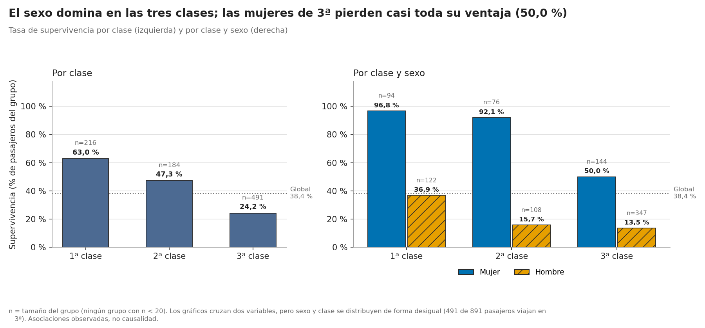

# Claude Code: equipo de agentes de IA para análisis de datos (Titanic)

Material del vídeo de **DataPython** donde un equipo de 4 agentes de IA en Claude Code analiza el dataset del Titanic: un **orquestador** dirige y revisa el trabajo de tres especialistas (**data-cleaner**, **data-analyst** y **visualizer**).

▶️ Vídeo: https://youtu.be/aloDFSzy6YM
🔔 Canal: https://www.youtube.com/@Aquapying

## ¿Quién sobrevivió al Titanic?

| | Supervivencia | n |
|---|---|---|
| Mujeres | **74,2 %** | 314 |
| Hombres | **18,9 %** | 577 |
| 1ª clase | 63,0 % | 216 |
| 2ª clase | 47,3 % | 184 |
| 3ª clase | 24,2 % | 491 |

Supervivencia global: 38,4 % (342 de 891). El informe completo, con pruebas estadísticas y regresión logística, está en [`outputs/analysis_report.md`](outputs/analysis_report.md).



## Contenido

```
.claude/agents/          Los 4 agentes (reutilizables con cualquier dataset)
  orchestrator.md        Dirige, coordina y cuestiona; no hace el trabajo
  data-cleaner.md        Nulos, tipos y duplicados; nunca toca el original
  data-analyst.md        EDA con cifras, n y pruebas estadísticas
  visualizer.md          Gráficos en español, con n en cada barra
CLAUDE.md                Memoria del proyecto (Claude la lee al abrir cada sesión)
titanic.csv              Dataset original (891 pasajeros)
scripts/                 El código que generaron los agentes
  01_limpieza.py         titanic.csv -> outputs/titanic_clean.csv
  02_analisis.py         -> outputs/tables/*.csv
  03_graficos.py         -> outputs/figures/*.png
outputs/                 Datos limpios, informes, 18 tablas y 11 gráficos
```

## Cómo usarlo

### Con Claude Code (el flujo del vídeo)
1. Instala Claude Code (en el vídeo se usa la extensión dentro del IDE Antigravity) e inicia sesión con `/login`.
2. Clona el repo y abre la carpeta:
   ```bash
   git clone https://github.com/Aquapy/Claude-Code-Agentes-Titanic.git
   cd Claude-Code-Agentes-Titanic
   ```
3. Lanza el orquestador como agente principal y pídele el análisis:
   ```bash
   claude --agent orchestrator
   ```
   > Analiza titanic.csv

   Con `/agents` verás los cuatro agentes.

**Usarlo con otro dataset:** copia la carpeta `.claude/agents/` a tu proyecto (o a `~/.claude/agents/` para tenerlos en todos tus proyectos). Los agentes son genéricos y no dependen del Titanic.

### Reproducir el análisis sin agentes
```bash
pip install -r requirements.txt
python scripts/01_limpieza.py
python scripts/02_analisis.py
python scripts/03_graficos.py
```
En Windows, si ves errores de codificación, ejecuta antes `set PYTHONIOENCODING=utf-8`.

## Lo que aprendimos (y no salió perfecto)
- Los agentes creados durante una sesión no se cargan hasta abrir una sesión nueva.
- Los sub-agentes dejaron parte del código en una carpeta temporal: pide explícitamente que lo guarden en `scripts/`.
- Revisa siempre el código y las decisiones: son **asociaciones, no causas**, y los tickets compartidos hacen que los p-valores estén algo sobreestimados.

## Contacto
📩 aquapyingenieria@gmail.com · [Instagram](https://www.instagram.com/aquapy_ingenieria) · [Facebook](https://www.facebook.com/aquapy.ingenieria)
